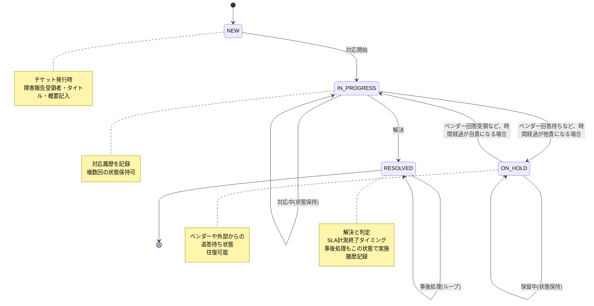

# 使用例

> **Note**: 詳細な使用例は実装完了後に追加されます。

## クイックスタート

`./mvnw spring-boot:run`

起動後: `http://localhost:8080`

## テスト実行

`./mvnw test`

---

## チケット状態遷移

### ステート遷移図

### 状態遷移表

| 現在の状態  | 遷移先      | 条件/理由 | 業務シナリオ       |
| ----------- | ----------- | --------- | ------------------ |
| NEW         | IN_PROGRESS | 対応開始  | 障害報告受領時     |
| IN_PROGRESS | IN_PROGRESS | 同一状態  | 対応履歴を追加記録 |
| IN_PROGRESS | ON_HOLD     | 外部待機  | ベンダー回答待ち   |
| IN_PROGRESS | RESOLVED    | 完了      | 問題解決時         |
| ON_HOLD     | IN_PROGRESS | 返答到着  | ベンダー回答受領   |
| ON_HOLD     | ON_HOLD     | 同一状態  | 再度問い合わせ等   |
| RESOLVED    | RESOLVED    | 同一状態  | 事後処理・ログ記録 |

### アーキテクチャ設計方針

**責務分離**

- **Dev層**: 状態遷移ルールのバリデーション
    - ドメイン層：Status値オブジェクトで遷移ルールを厳密に定義
    - アプリケーション層：チケットエンティティでの遷移処理
- **Ops層**: ビジネス例外の判定と対応
    - 報告受領の判定（キャンセル→RESOLVED）
    - チケット継承・統合の判定
    - 担当者不在時の対応フロー
    - 優先度エスカレーション判定

- **レポート層**: 期間集計と分析
    - SLA違反検出
    - 一定期間経過チケットのレポート化

これにより、状態遷移ロジックをシンプル&保守性高く保つ。

---

**具体的な操作例・開発ツールの設定は実装完了後に追加予定です。**
